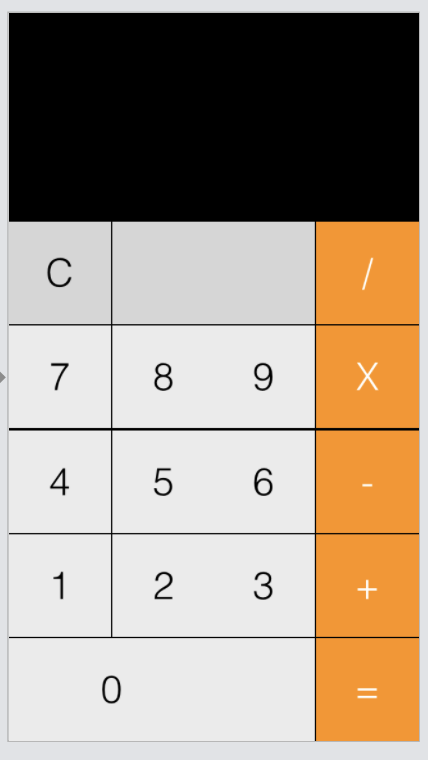
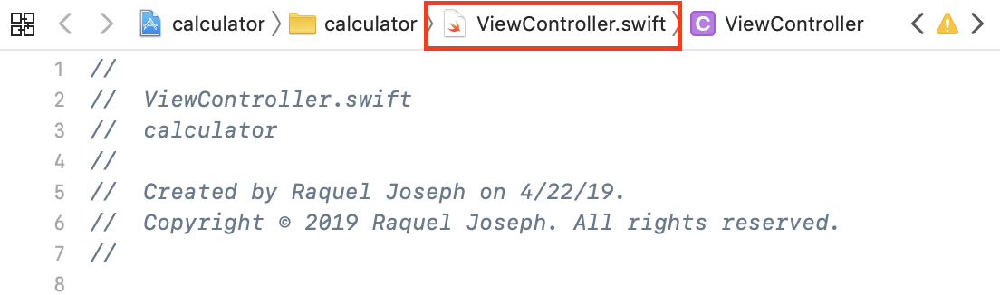
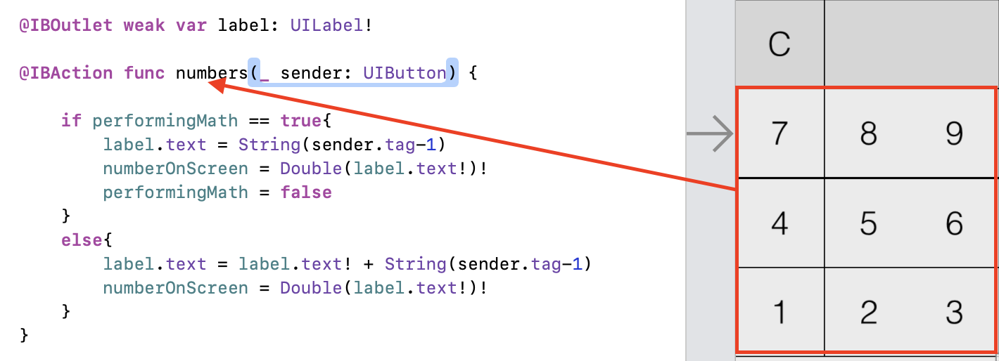
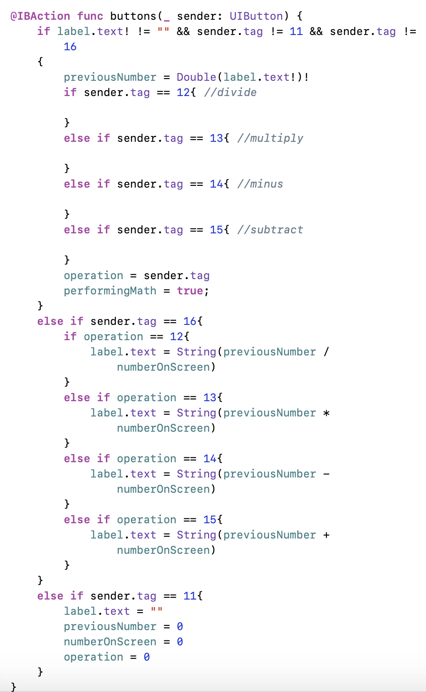
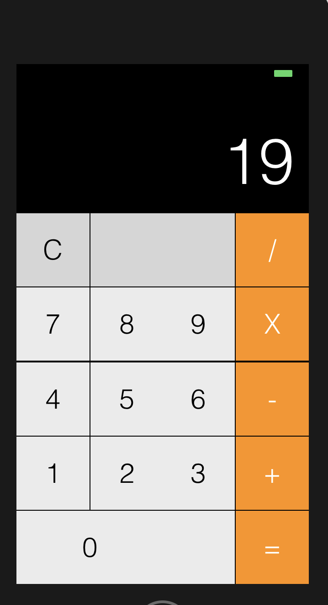
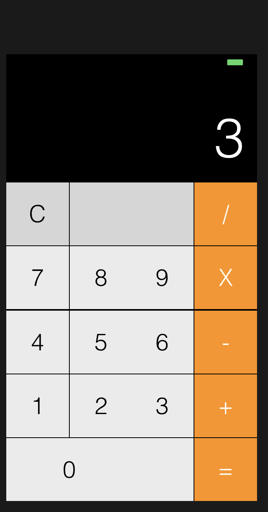
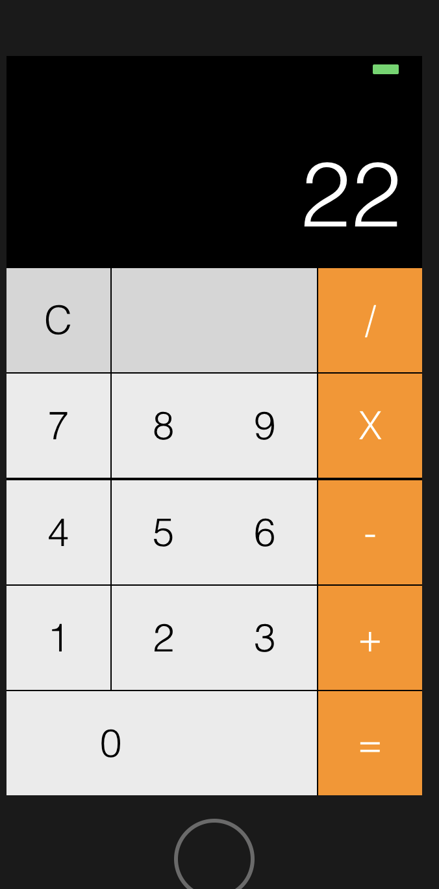

# Independent Study Week Four and Five: The NEW MVP

Week 4/5
These two weeks have been hard and my partner, Arieta, and I have come to a realization that the original app that we wanted to build was not feasible and ultimately too hard to build within the next 4 weeks that we have.

### Steps to Success
Okay so in week four we were set on the community service app so I started building in the swift playground. I wanted to start with backend code while Arieta does the front end. That way we could put everything together and fix our bugs. 

During week five, I decided to learn how to connect the backend with the frontend so that when Arieta and I merge code, I could just connect it without having too much trouble. I decided the best way to go about doing that was by building a calculator.

I googled calculator swift tutorial and [How To Make A Calculator App In Xcode 8 (Swift 3.0)](https://youtu.be/AG2QDwmj64A) was the first video that popped up so I decided to follow it.

#### Step one: Add the buttons

#### Step two: Open the controller

#### Step three: Drag buttons into controller

#### Step four: Add code

#### Step five: Run code

For some reason, when I pressed the = sign, my code wasn’t working. I didn’t understand why because all the code that I typed was the same as the tutorial. I started commenting stuff out to see where the bug was. 

After hours of commenting out and exploring swift to see what i could do. I realized that the button wasn’t connected to the code so it wouldn’t do anything. I then had to fix the connection with the rest of my buttons because after I connected the = sign, the rest of the buttons broke.

### Our new app idea
We spent hours trying to think of a new idea. We had to come up with in it a day so it was constant texting back and forth between us and then finally we had an idea. An app where clubs can create their own stores to help with fundraising. People would be able to oder off the app and a club would deliver their purchase to them.

### Takeaways
Its okay to change an idea. Realizing that your first idea was too much too handle is better than trying to stress yourself over completing it by a deadline.
Just breathe. Remember to take care of yourself. Mental health is just as important as working. If your mental health is not up to par then your work will not be as good as you want it to be.