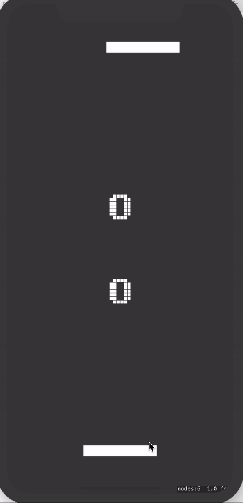

# Week 9 Independent Study: MVP Completed!

After 9 long weeks of learning swift Arieta and I finally completed our pong. We changed our project idea about 3 times but in the end, we finished our MVP!

### Collaboration
We googled ways to collaborate efficiently without coming across many merge conflicts and there was no real solution, so we decided to use airdrop. This was the easiest way to collaborate as we broke our app into parts. She did parts 1 & 3 while I did parts 2 & 4. Every time we completed a part of the app we would airdrop the folders to each other and delete the old folders. We had no merge conflicts and was able to complete our project in a few days.

Even though we both did different parts, we were able to learn effectively what each other did. We explained what we both did so that we would not be confused when building the next part. This way, we understand our project as a whole rather than just our parts.

### The App



### What I learned
I learned how to move a sprite and add a score every time the player or computer won. I also was able to make the ball reset so that the game starts over so it is a fair game. 

#### This code adds the score of whoever won. In order to do this, I had to create a function to make it more efficient.
```swift
var score = [Int]()
    
func startGame(){
score = [0,0]
topLbl.text = "\(score[1])"
btmLbl.text = "\(score[0])"
}
    
func addScore(playerWhoWon : SKSpriteNode){
ball.position = CGPoint(x: 0, y: 0)
ball.physicsBody?.velocity = CGVector(dx: 0, dy: 0)

if playerWhoWon == main {
    score[0] += 1
    ball.physicsBody?.applyImpulse(CGVector(dx: 20, dy: 20))
}
else if playerWhoWon == enemy {
    score[1] += 1
    ball.physicsBody?.applyImpulse(CGVector(dx: -20, dy: -20))
}

topLbl.text = "\(score[1])"
btmLbl.text = "\(score[0])"
}

if ball.position.y <= main.position.y - 70 {
    addScore(playerWhoWon: enemy)
}
else if ball.position.y >= enemy.position.y + 70 {
    addScore(playerWhoWon: main)
}

```

#### This code moves the sprite so that it acts as the pong ball. The pong balls also move in a similar way.
```swift
override func didMove(to view: SKView) {
    
    startGame()
    
    topLbl = self.childNode(withName: "topLbl") as! SKLabelNode
    btmLbl = self.childNode(withName: "btmLbl") as! SKLabelNode
    
    ball = self.childNode(withName: "ball") as! SKSpriteNode
    enemy = self.childNode(withName: "enemy") as! SKSpriteNode
    main = self.childNode(withName: "main") as! SKSpriteNode
    
    ball.physicsBody?.applyImpulse(CGVector(dx: 20, dy: 20))
    
    let border = SKPhysicsBody(edgeLoopFrom: self.frame)
    
    border.friction = 0
    border.restitution = 1
    
    self.physicsBody = border
}
    
override func touchesBegan(_ touches: Set<UITouch>, with event: UIEvent?) {
for touch in touches {
    let location = touch.location(in: self)
    
    main.run(SKAction.moveTo(x: location.x, duration: 0.2))
}
}
override func touchesMoved(_ touches: Set<UITouch>, with event: UIEvent?) {
for touch in touches {
    let location = touch.location(in: self)
    
    main.run(SKAction.moveTo(x: location.x, duration: 0.2))
}
}
```

#### Full code
```swift
import SpriteKit
import GameplayKit

class GameScene: SKScene {

var ball = SKSpriteNode()
var enemy = SKSpriteNode()
var main = SKSpriteNode()

var topLbl = SKLabelNode()
var btmLbl = SKLabelNode()

var score = [Int]()

override func didMove(to view: SKView) {

startGame()

topLbl = self.childNode(withName: "topLbl") as! SKLabelNode
btmLbl = self.childNode(withName: "btmLbl") as! SKLabelNode

ball = self.childNode(withName: "ball") as! SKSpriteNode
enemy = self.childNode(withName: "enemy") as! SKSpriteNode
main = self.childNode(withName: "main") as! SKSpriteNode

ball.physicsBody?.applyImpulse(CGVector(dx: 20, dy: 20))

let border = SKPhysicsBody(edgeLoopFrom: self.frame)

border.friction = 0
border.restitution = 1

self.physicsBody = border

}

func startGame(){
score = [0,0]
topLbl.text = "\(score[1])"
btmLbl.text = "\(score[0])"
}

func addScore(playerWhoWon : SKSpriteNode){

ball.position = CGPoint(x: 0, y: 0)
ball.physicsBody?.velocity = CGVector(dx: 0, dy: 0)

if playerWhoWon == main {
    score[0] += 1
    ball.physicsBody?.applyImpulse(CGVector(dx: 20, dy: 20))
}
else if playerWhoWon == enemy {
    score[1] += 1
    ball.physicsBody?.applyImpulse(CGVector(dx: -20, dy: -20))
}

topLbl.text = "\(score[1])"
btmLbl.text = "\(score[0])"
}

override func touchesBegan(_ touches: Set<UITouch>, with event: UIEvent?) {
for touch in touches {
    let location = touch.location(in: self)
    
    main.run(SKAction.moveTo(x: location.x, duration: 0.2))
}
}
override func touchesMoved(_ touches: Set<UITouch>, with event: UIEvent?) {
for touch in touches {
    let location = touch.location(in: self)
    
    main.run(SKAction.moveTo(x: location.x, duration: 0.2))
}
}

override func update(_ currentTime: TimeInterval) {
// Called before each frame is rendered

enemy.run(SKAction.moveTo(x: ball.position.x, duration: 1.0))

if ball.position.y <= main.position.y - 70 {
    addScore(playerWhoWon: enemy)
}
else if ball.position.y >= enemy.position.y + 70 {
    addScore(playerWhoWon: main)
}
}
}

```

### Takeaways
* Be patient with yourself. Understanding your limits is important because you want to push yourself but you never want to push yourself too hard.
* Know that your work is as important as anyone else’s. Comparing your work to others is not a healthy way of going about things. Your project is as valuable as you make it.