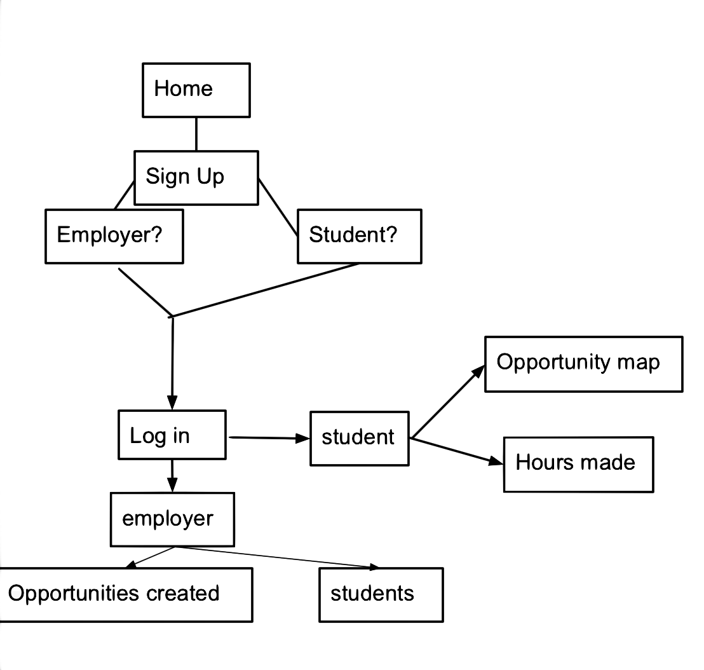

# Independent Study Week Three: The MVP
I spent week three thinking and tinkering with swift. I was trying to understand what I thought would be necessary in the beginning stages of our community service app.
## The Skateboard
What is a skateboard you ask? Its the MVP of the project, the minimum viable product. Thinking of the skateboard is probably the most important part of creating your product. It guides you and helps you to understand what you are building.

I started thinking about what the app needed.

Two different people would have access to the app: students and employers. Since this is a community service app, people would need to know where available opportunities are. I was thinking about using an api for this but the problem with that is how would their hours be verfied if the employer has to verify it.

Universal pages for students and employer:
* home
* log in
* sign up

Student pages:
* map
* hours made and who they volunteered with

Employer pages:
* opportunities they created
* tracker of students and volunteer hours
* sign off page for students who completed their hours

From the youtube tutorial I used, it did not teach me how to create multiple views in swift which is important for creating the app. I decided to google how to make more than one page on swift and I watched the first youtube video that popped up.

[iOS Development with Swift Tutorial - 17 - Multiple Views or Screens](https://www.youtube.com/watch?v=B9yV4YeEmNA)

This video helped me a lot because I was able to now have a base with all of my views.

Here is the plan that I made for the app.

## Possible Enhancements
Before I thought of my skateboard, I thought of the car which I figured was not going to be feasible to build in the next six weeks. I decided that I should write down the enhancements I was thinking about so that if I have time I can come back and add it to the app.

1. a page for schools to track students so students would not forget to send their hours
2. a feature where students can connect with people who are doing the same opportunities so that they can make friends/connections.

## Takeaways
1. Make sure your plans are feasible. SMART goals are important when creating something because it allows you to have an MVP for yourself and not overwork.  
What is a SMART goal?
    * S = specific
    * M = measurable
    * A = attainable
    * R = relevant
    * T = time based
2. Understanding yourself and your abilities is important. Being able to know what you are capable of will help you to determine what would be the best way to go about building your project.

## Sources
https://gist.github.com/shaunlebron/746476e6e7a4d698b373
https://github.com/adam-p/markdown-here/wiki/Markdown-Cheatsheet