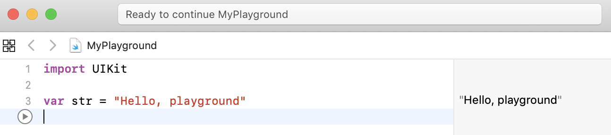

# Independent Study Week Two: Choosing An App

This week I had two objectives: finishing the [intro lessons of swift](https://www.youtube.com/watch?v=2OZ07fklur8&index=1&list=PLMRqhzcHGw1ZqzYnpIuQAn2rcjhOtbqGX) on youtube and thinking of an app idea.

It took me exactly three days to finish the lessons. I completed that goal by being persitant with my work and making sure that my work was productive.

## What I learned
The lessons started off in the swift playground

I did not understand what `import UIKit` meant so I decided to google it. UIKit is the framework that you'll user most often when developing iOS applications. It defines the core components of an iOS application, from labels and buttons to table views and navigation controllers.

Refer to my [notes](../notes/swift_intro.md) to know specifically what each lesson was about.

### code that suprised me! (in a good way)

## App Ideas
As seen in the readme our four ideas were
* Community Service App
* Connecting perspective college students
* Moodvie
* Party Planning app

## References
https://code.tutsplus.com/tutorials/ios-from-scratch-with-swift-first-steps-with-uikit-cms-25461