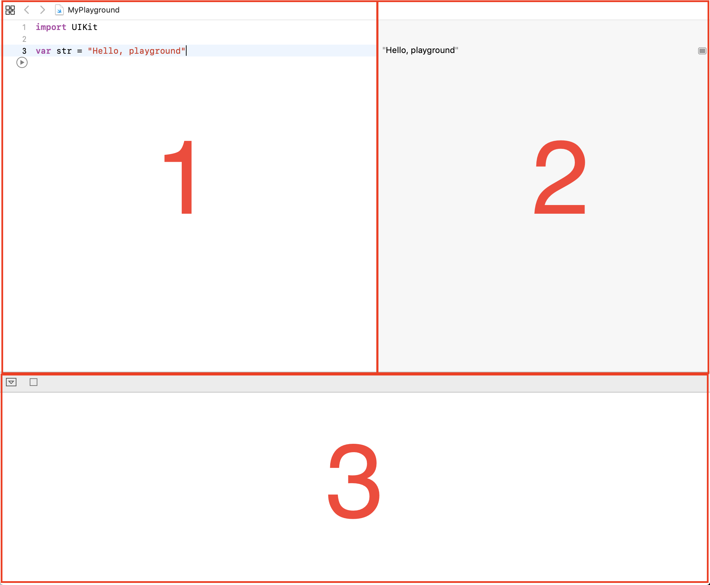

# Week Two
## Built-in Functions
* `Int(x)` turns x into an integer.
* `Round(x)` rounds x

## Lesson Zero: Swift Setup


1. editor
2. run code 
3. debugger

## Lesson One: Variables
Setting variables:
```swift
var str = "Hello, playground"
```
`var` is only used to declare variables. When calling the variable, you just need to use the variable name.

`let` allows you to set the value of a variable. For example:

```swift
let str = "Hello"
```
## Lesson Two: Data Types
In swift, there are 5 data types
* String: Piece of text
* Int: Whole numbers, positive and negative integers
* Float: Decimal Numbers
* Double: Large decimal numbers
* Bool: True or False

Setting Data Types:
```swift
var str:String = "Hello, playground" 
var a:Int = 1
var b:Float = 2.3
var c:Double = 13.910456355335566
var d:Bool = true
```
## Lesson Three: Conditionals
### if statements
```swift
var a = 3
if a < 3{
    print('a is less than 3')
}
```
### else if statements
```swift
var a = 3
if a < 3{
    print('a is less than 3')
}
else if a > 3{
    print('a is greater than 3')
}
```
### else statements
```swift
var a = 3
if a < 3{
    print('a is less than 3')
}
else if a > 3{
    print('a is greater than 3')
}
else{
    print('nothing was true')
}
```
## Lesson Four: Switch Statements
### Switch Statements

```swift
var someCharacter:Character = 'a'

switch someCharacter{
    case 'a':
        print('Character is a')
    case 'b':
        print('Character is b')
    case 'c':
        print('Character is c')
}
```

## Lesson Five: Loops
